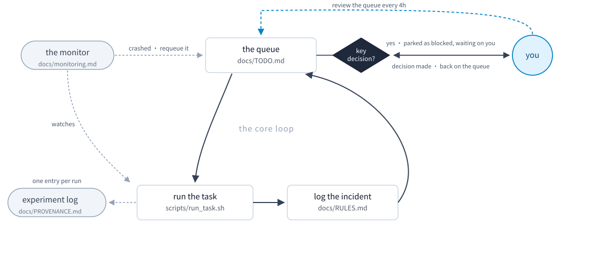

# agent-experiment

[](README.md)
[](README.en.md)
[](LICENSE)
[](https://docs.claude.com/en/docs/claude-code/skills)
[](#requirements)

> A research automation workflow that runs 24/7: it runs your experiments,
> maintains your public repos through Git, and keeps your LaTeX (Overleaf) paper
> up to date.

Install the skill once, run one deploy command inside your project, and 26 rules
of long-horizon working discipline, three record files, a monitoring guide and a
task script that resumes after an interruption land in place. The rules come out
of the work behind a real top-tier conference paper: a project that ran unattended
for a long stretch, and every rule in here has a real incident behind it.

**What it is good for:**

- **Automated workflows**: one chain running for tens of hours, resuming where it
  stopped, with nobody sitting at the terminal
- **SOTA experiments**: several baselines running side by side, where every number
  can be traced back to where it came from
- **Repetitive runs across seeds and configs**: write them into the queue once, and
  whichever card frees up picks up the next one

> [!WARNING]
> **This automates execution, not judgement.** On a decision that matters it stops
> and waits for you: whether a batch of results can be trusted, whether something
> gets pushed to a public repo, whether a number in the paper changes. While it
> waits it parks the item in the blocked section of `docs/TODO.md` and moves on to
> work that does not depend on it, so it never idles, but that one item stays stuck
> until you come back. **Review `docs/TODO.md` at least every 4 hours**; `/loop` can
> do the reminding, see [Monitoring a long run](#monitoring-a-long-run).

## Architecture



## Quick start

```bash
git clone https://github.com/hashiruu/agent-experiment.git
cd agent-experiment
./install.sh                 # -> ~/.claude/skills/agent-experiment
```

Without cloning:

```bash
curl -fsSL https://raw.githubusercontent.com/hashiruu/agent-experiment/main/install.sh | bash
```

Restart Claude Code afterwards. Skills are loaded at session start, so you will
not see it until you do.

Then, in the project you want to set up:

```
/agent-experiment
```

or just say "set up the long-task workflow in this project". The skill works out
which layers apply, asks you when it is unsure, and calls the deploy script.

### With Codex, Gemini CLI or any other agent

Claude Code is not required. Everything under `skills/agent-experiment/assets/` is
plain Markdown and Bash, and the deploy script runs on its own:

```bash
cd your-project
bash ~/.claude/skills/agent-experiment/deploy.sh --dry-run   # see what it would write
bash ~/.claude/skills/agent-experiment/deploy.sh             # write it
```

Different agents look for different filenames. The script writes `CLAUDE.md`, so
symlink it and both stay in sync:

```bash
ln -s CLAUDE.md AGENTS.md     # Codex
ln -s CLAUDE.md GEMINI.md     # Gemini CLI
```

Same idea elsewhere: point whatever file your tool reads at `CLAUDE.md`, or just
copy the contents across.

## What it puts in your project

Previewed here in an **empty project**; with an existing `CLAUDE.md` the first
line becomes "append" instead.

```console
$ bash ~/.claude/skills/agent-experiment/deploy.sh --dry-run
  [dry-run] 新建   CLAUDE.md            (层: l1,l2,l3)
  [dry-run] 新建   docs/RULES.md
  [dry-run] 新建   docs/TODO.md
  [dry-run] 新建   docs/PROVENANCE.md
  [dry-run] 新建   docs/monitoring.md
  [dry-run] 新建   scripts/run_task.sh
  [dry-run] 追加   .gitignore

完成 —— 目标: /path/to/your/project
(预览模式: 什么都没写)
下一步: 在看到任何结果之前, 先把 docs/PROVENANCE.md 的判断标准填掉。
```

The script speaks Chinese, like the rules it deploys.

| File | What it is for | Overwritten on re-run? |
|---|---|---|
| `CLAUDE.md` | the rules your agent reads before it starts work, all 26 of them, fenced between a pair of comment markers | only the text between the markers; anything you wrote outside them stays |
| `docs/RULES.md` | what went wrong in *this* project and what to do next time. Starts empty; you add to it as you go | No |
| `docs/TODO.md` | what is still to do, what is blocked waiting on someone, what was dropped | No |
| `docs/PROVENANCE.md` | which file each published number came from, plus the criteria you fixed **before** looking | No |
| `docs/monitoring.md` | how to monitor a run that lasts tens of hours: eight ways a failure stays silent. Ready to use, nothing to fill in | No |
| `scripts/run_task.sh` | the script template for long runs: resumes after an interruption, never fakes success on failure | No |
| `.gitignore` | keeps run artifacts, logs and LaTeX intermediates out of git | appended once, at the end |

Once those five files under `docs/` and `scripts/` exist they belong to the
project. Changing that takes `--force`.

`run_task.sh` treats its own directory as the run root and writes only relative
paths, so logs, results and progress stamps land next to it under `scripts/`.
That is deliberate: never write a global path (see L2 rule 14). Move the script
if you want the artifacts elsewhere.

## The three layers

Rules are tagged by scope, so a frontend project does not inherit GPU advice.

**Numbering is global 1-26, not per layer**: L1 is rules 1-11, L2 is 12-19, L3 is
20-26. So "L3 rule 21" means global rule 21, not the 21st rule of L3 (L3 only has
7). Numbers do not shift when a layer is dropped, so cross-references never break.

| Layer | Rules | Keep it when | One example |
|---|---|---|---|
| L1 general | 11 | always | Never edit a script that is currently executing. bash reads it incrementally by byte offset, so an edit mid-run shifts the bytes under the interpreter and it resumes inside a token |
| L2 compute | 8 | GPU / long batch jobs | `CUDA_VISIBLE_DEVICES` values and the card numbers in OOM messages are visible indices, not physical cards; the only reliable mapping is `ls -l /proc/<pid>/fd \| grep nvidia` |
| L3 writing | 7 | LaTeX + shared remote | Trust only `Output written ... (N pages)`. The largest page number in `.aux` is where the last float landed, not the length of the document |

<details>
<summary><b>All 26 rules</b> (titles only; full text with the "how it was hit" notes lives in <a href="skills/agent-experiment/assets/CLAUDE.md">assets/CLAUDE.md</a>, in Chinese)</summary>

**L1 general (1-11)**

1. Never edit a script that is currently executing
2. Completion markers need a timestamp check; a failure path never writes one
3. Check the existing queue before launching, not just the process list
4. After adding a flag or changing an interface, sweep every call site
5. After changing any number, grep the whole document for every old value
6. Confirm the sample size before judging a distribution-like metric
7. "These two numbers are identical" requires a full-precision recompute
8. If two points differ in more than one variable, you have a hypothesis, not a conclusion
9. Criteria before data
10. Stop when diagnosis costs more than it returns, and write down where to resume
11. Admit reversals; do not quietly rewrite

**L2 compute (12-19)**

12. There are three GPU numbering schemes and only one is reliable
13. An `nvidia-smi` error does not mean the card is broken
14. Pipeline isolation: one directory per run, relative output paths only
15. Staged scripts must let every step be rerun on its own
16. A failure kills the whole chain while the file count still looks like progress
17. Report the trivial baseline alongside any metric
18. Measure the intermediate artifact before explaining the final metric
19. Fairness protocol for baseline tuning (fixed up front, never revised afterwards)

**L3 writing (20-26)**

20. The remote is shared; always pull before you push (the rule body also covers the post-push consistency assertion)
21. LaTeX must be installed locally, and every edit must be compiled
22. Trust only the page count the compiler reports
23. Changing a table number means changing the prose that discusses it
24. Every figure and table sits next to the paragraph discussing it
25. Traceability: every published number points at three things
26. Declare every deviation

</details>

## Monitoring a long run

A job runs for tens of hours and the agent cannot watch it the whole time. The
real problem is that **failure is usually silent**: the process died, the artifact
count stopped moving, the log went quiet. From the outside all of that looks
exactly like "still running".

`docs/monitoring.md` covers eight practices for this. The ones that bite hardest:

- **Grepping only for success markers makes you blind to crashes.** `grep "step="`
  says nothing at all on a crash, a hang or an OOM. Ask yourself: if this process
  died right now, would my filter print anything? If the answer is not yes, widen
  it to `grep -E "step=|Traceback|CUDA out of memory|Killed|FAILED|assert"`. Noise
  beats silence on a crashloop.
- **Monitoring and compute belong in separate process trees.** Launch compute with
  `setsid nohup`. The source project had its monitor killed once and the compute
  chain was untouched; in one tree, stopping the monitor stops the experiment.
- **An artifact count alone does not prove anything is alive.** After an OOM the
  chain exits and the process disappears while the file count sits still, so
  counting alone reads as "still running" and costs you an hour of waiting. Check
  artifacts and processes together.
- **Every watcher needs a stop condition.** One `while pgrep ...; do sleep; done`
  kept polling long after its target had finished, **spinning for 1 day 20 hours**
  before anyone noticed. It raises no error, uses no resources, and never exits by
  itself.

The other four (event dedup, re-arming after a trigger, staggered thresholds,
poll intervals) are in
[`docs/monitoring.md`](skills/agent-experiment/assets/practices/monitoring.md).

### Let Claude Code do the checking on a timer

That "review every 4 hours" can be handed to `/loop`, which re-runs one prompt at
a fixed interval:

```
/loop 4h read docs/TODO.md and docs/RULES.md, report where the queue stands, which blocked items are waiting on my decision, and what new incidents were logged; anything that can move without my decision, just do it
```

Intervals take `m` / `h` / `d` (`4h` means every four hours). Two things worth
knowing: a recurring task **expires after 7 days**, so re-arm it on longer
projects, and it only brings the state to you. The key decisions are still yours.

## Using run_task.sh

The skeleton runs nothing by itself. You write each stage as one `step` line:

```bash
step 1_prepare  python code/prepare.py --out ./out_$TAG
step 2_train    python code/train.py   --gpu "$GPU" --out ./results/$TAG

T0=$(date +%s)
step 3_eval     python code/eval.py    --weights ./results/$TAG/best.pth \
                                       --out ./results/$TAG/RESULT.txt
assert_fresh "./results/$TAG/RESULT.txt" "score=" "$T0"   # exists, non-empty, has the field, produced this round
```

Those lines go into the "任务主体" (task body) section of `scripts/run_task.sh`;
a comment marks the spot. Then run `./scripts/run_task.sh myrun 0`. The first
argument is the tag (`$TAG` in the script, which keeps this run's output
directory, log and stamps separate); the second is the GPU (`$GPU`, default 0).
It does four things:

- each successful `step` drops a stamp in `.stamps/`, so a rerun skips what is done;
- any failing step writes `FAILED_<tag>` and exits, and **never writes a completion marker**;
- only a full success writes `ALLDONE_<tag>`, holding start/end times and the key config you fill in;
- `assert_fresh` confirms the artifact came from this round. Check only that a file exists and last round's leftover gets accepted as a new result.

For long runs, launch with `setsid nohup ./scripts/run_task.sh myrun 0 &` so that
killing the monitor does not kill the compute chain.

**Rerunning a step after you change the code**: progress stamps live in
`scripts/.stamps/<tag>/`, one file per step. Delete a stamp and that step runs
again; delete the directory and the whole chain does.

```bash
rm scripts/.stamps/myrun/2_train      # changed train.py, rerun training
rm -rf scripts/.stamps/myrun          # start over
```

Do not skip this. Change the code without deleting the stamp and the script
quietly skips training, then hands you last round's weights as a fresh result,
which is exactly the "it looked like it succeeded" failure rule 2 exists to prevent.

## Commands

```bash
bash ~/.claude/skills/agent-experiment/deploy.sh --dry-run          # preview
bash ~/.claude/skills/agent-experiment/deploy.sh                    # all layers
bash ~/.claude/skills/agent-experiment/deploy.sh --layers l1,l2     # subset
bash ~/.claude/skills/agent-experiment/deploy.sh --target ../other  # elsewhere
bash ~/.claude/skills/agent-experiment/deploy.sh --force            # overwrite those five files too
```

| Flag | Default | What it does |
|---|---|---|
| `--target DIR` | current directory | which project to deploy into |
| `--layers l1,l2,l3` | all three | which layers to keep; an unknown layer name is an error, never a silently empty ruleset |
| `--dry-run` | off | print what would happen, write nothing |
| `--force` | off | allow overwriting those five existing files (three records + the monitoring guide + `run_task.sh`) |

For the installer: `--project` installs into `./.claude/skills/` of the **current
directory**, scoped to that repo and committable for a team. It goes by where you
run it from, so run it in **your own project root** and call the template script
by absolute path:

```bash
cd ~/my-project
bash ~/where-you-cloned/agent-experiment/install.sh --project
```

`--dir PATH` installs wherever you point it.

## In practice: the more GPUs, the better it pays

Write the experiments you want into `docs/TODO.md` and leave the rest to it:
whichever card is free gets the next job, and the moment one finishes another
starts. Four cards means four chains running at once, and all you do is glance at
the queue every few hours. Measured at roughly 25x, seven days covering close to
what half a year used to.

Running several chains at once is not hard because starting a job is hard. It is
hard because the chains step on each other: whether that card is really free,
whether it collides with itself, whether a collision corrupts the results, which
step to resume from after a crash. It handles all of that, so what you come back
to in the morning is something you can put straight into the paper.

## Design principles

The rules will age. What transfers is the mechanism that produced them:

1. Write the incident down when it happens, into `docs/RULES.md`, with how it was
   hit. A rule with no instance is noise that buries the real ones.
2. Allow self-reversal. When a rule turns out to be wrong, append the correction
   in place and keep the original. A visible "I was wrong here" beats apparent
   consistency: the next reader, usually the same agent, will otherwise reproduce
   the reasoning that failed.
3. Criteria before data. Significance thresholds and fairness protocols get
   written down before results are seen, or they are not criteria, they are
   picking the ruler to fit the answer.
4. Every published number traces to a file. Weights, code, log.

Point 2 is the counterintuitive one. The source project's rule file still carries
a whole retracted conclusion: a judgement made on 6 samples killed a run that was
configured correctly. Keeping that retraction is worth more than a clean rewrite.

## Requirements

- **bash 3.2+** (what macOS ships is enough). It uses `BASH_SOURCE` and `${var//,/ }`, so `sh` will not do.
- **awk / grep / sed / mktemp**, whatever your system ships.
- **git**, only for the `curl | bash` path, where the script clones itself.
- **Claude Code**, optional. `deploy.sh` runs without it; see the FAQ.
- **Platform: Linux.** `install.sh` and `deploy.sh` are portable. Two lines of the
  `run_task.sh` skeleton are GNU-only: `stat -c %Y` in `assert_fresh()` (BSD:
  `stat -f %m`) and `date -d @$START` in the completion marker (BSD: `date -r
  $START`). Editing those two lines is the simplest fix. Homebrew coreutils works
  too, but it installs them as `gstat` / `gdate`, so `gnubin` has to be on your
  PATH before `stat -c` resolves. Windows: use WSL.

## FAQ

**I already have a `CLAUDE.md`. Will it be overwritten?**
No. The block is appended below your content, and later runs replace only that
block. What you wrote is never touched.

**Can I install L1 only and add layers later?**
Yes. `--layers l1` installs 11 rules; change the flag and re-run to add more, and
the block refreshes in place. Rule numbers are identical in every combination, so
cross-references never break.

**I have half-filled records. Will a re-run wipe them?**
No. The five files under `docs/` and `scripts/` are never overwritten once they
exist, unless you pass `--force` yourself.

**Can I use this without Claude Code?**
Yes, see [With Codex, Gemini CLI or any other agent](#with-codex-gemini-cli-or-any-other-agent) above.

**How do I update?**
`git pull`, then re-run `./install.sh`, which **replaces the whole skill
directory** - back up first if you edited the rules under
`~/.claude/skills/agent-experiment/assets/`.
Projects you already deployed into are unaffected; re-run `deploy.sh` there if you
want the newer rules.

**How do I uninstall?**
`rm -rf ~/.claude/skills/agent-experiment`, or `./.claude/skills/agent-experiment` if
you installed with `--project`. Files already deployed into a project are your
records, so keep or delete them as you like. Removing every trace takes two
edits: in `CLAUDE.md`, delete everything between `<!-- agent-experiment:begin ... -->`
and `<!-- agent-experiment:end -->`, markers included; in `.gitignore`, delete the
block starting at `# --- agent-experiment ---` (that line is also how the script
knows it already appended).

**I installed with `--project`. What path do the commands use?**
Replace every `~/.claude/skills/agent-experiment/` below with
`./.claude/skills/agent-experiment/`.

**I do not trust `curl | bash`.**
You should not. Split it: `curl -fsSL <url> -o install.sh`, read it, then
`bash install.sh`. The script does three things: copy `skills/agent-experiment/`
into your skills directory, `chmod +x`, and verify nothing is missing. The script
that writes into your project is `deploy.sh`, and it has `--dry-run`.

**Will it push on its own, or edit my code?**
Two separate layers, do not conflate them. **The template itself will not.**
`deploy.sh` writes seven files into your project (one of which appends a block to
`.gitignore`), touches no git config, goes nowhere online, and asks for no
permissions. The only network call is `install.sh` cloning this repo on the
`curl | bash` path, and `run_task.sh` runs nothing until you put your own
commands in it.

**But the seven L3 rules are precisely about teaching an agent to push**, which
is their purpose, not a side effect. So what actually decides whether something
gets pushed at 3am is how you launch your agent and what you granted it, not this
template. If you do not want it near Git, do not install L3: `--layers l1` or
`--layers l1,l2`.

## Notes

The rules are in Chinese. They were recorded in the language the incidents
happened in, and translating them costs the precision that makes them usable.

Dataset names and metric values in the rule examples have been replaced with
stand-ins. The incidents and their magnitude are real, but the specific numbers
are not the source project's results, so do not quote them.

## Layout

```
install.sh                       installs the skill
assets/architecture.svg          the diagram (zh / en)
skills/agent-experiment/
  SKILL.md                       entry point: when to deploy, which layers
  deploy.sh                      deployment script, safe to re-run, layer filtering
  assets/
    CLAUDE.md                    the 26 rules, L1 / L2 / L3
    gitignore.snippet
    scaffold/{RULES,TODO,PROVENANCE}.md
    scaffold/run_task.sh
    practices/monitoring.md      monitoring long runs: eight ways failure stays silent
```

## License

[CC BY-NC 4.0](LICENSE): free to use, modify and redistribute with attribution, **not for commercial use**.
