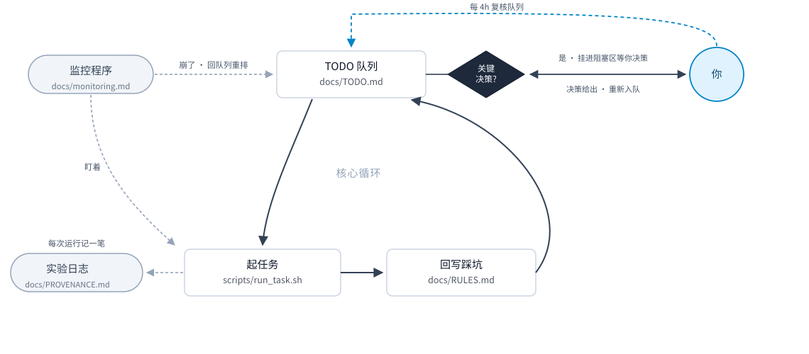

# agent-experiment

[](README.md)
[](README.en.md)
[](LICENSE)
[](https://docs.claude.com/en/docs/claude-code/skills)
[](#前置条件)

> [!WARNING]
> **它自动化的是执行，不是判断。** 关键决策它会停下来等你：这批结果能不能采信、要不要推到
> 公开仓库、论文里的数字该不该改。等的时候它把这件事挂进 `docs/TODO.md` 的阻塞区，同时继续
> 推进不依赖它的任务，所以它不会干等着，但那一件会一直卡到你回来。**建议至少每 4 小时过一遍
> `docs/TODO.md`**，可以用 `/loop` 定时提醒，见[监控长任务](#监控长任务)。

> 一个 7 × 24 小时不间断运行，帮你跑实验、用 Git 维护公开仓库、更新 LaTeX（Overleaf）论文的科研自动化工作流。

你只需要装一次 skill，然后在项目里运行一条部署命令，26 条长任务工作纪律、三份记录文件、
一份长任务监控手册、一个中断能接着跑的任务脚本就会自动落到位。规则来自一篇真实产出的顶会论文，那个项目长期无人值守地跑，每条规则背后都有一次真实的事故。

## 架构展示



## 快速开始

```bash
git clone https://github.com/hashiruu/agent-experiment.git
cd agent-experiment
./install.sh                 # 装到 ~/.claude/skills/agent-experiment
```

不想克隆：

```bash
curl -fsSL https://raw.githubusercontent.com/hashiruu/agent-experiment/main/install.sh | bash
```

装完重启 Claude Code。skill 在会话启动时才会被加载，不重启看不见。

然后在要设置的项目里：

```
/agent-experiment
```

或者直接说"给这个项目装上长任务工作流"。skill 会自己判断该用哪几层，拿不准会问你，然后调部署脚本。

### 用 Codex、Gemini CLI 或别的 agent

不依赖 Claude Code。`skills/agent-experiment/assets/` 里全是纯 Markdown 和 Bash，部署脚本单独就能跑：

```bash
cd 你的项目
bash ~/.claude/skills/agent-experiment/deploy.sh --dry-run   # 先看会写什么
bash ~/.claude/skills/agent-experiment/deploy.sh             # 落地
```

不同 agent 认的规则文件名不一样，脚本产出的是 `CLAUDE.md`，做个软链就行——内容是同一份，改一处两边都变：

```bash
ln -s CLAUDE.md AGENTS.md     # Codex
ln -s CLAUDE.md GEMINI.md     # Gemini CLI
```

其他工具同理：把它读的那个文件指向 `CLAUDE.md`，或者直接把内容拷过去。

## 它会往项目里放什么

下面是在一个**空项目**里预览的样子（已有 `CLAUDE.md` 的话第一行会变成"追加"）：

```console
$ bash ~/.claude/skills/agent-experiment/deploy.sh --dry-run
  [dry-run] 新建   CLAUDE.md            (层: l1,l2,l3)
  [dry-run] 新建   docs/RULES.md
  [dry-run] 新建   docs/TODO.md
  [dry-run] 新建   docs/PROVENANCE.md
  [dry-run] 新建   docs/monitoring.md
  [dry-run] 新建   scripts/run_task.sh
  [dry-run] 追加   .gitignore

完成 —— 目标: /path/to/your/project
(预览模式: 什么都没写)
下一步: 在看到任何结果之前, 先把 docs/PROVENANCE.md 的判断标准填掉。
```

| 文件 | 用途 | 重跑会不会被覆盖 |
|---|---|---|
| `CLAUDE.md` | agent 每次开工前会读的规则，26 条就写在这儿。夹在一对注释标记之间 | 只重写标记之间那段，标记之外你写的内容不动 |
| `docs/RULES.md` | 记这个项目自己踩过的坑：出了什么事、下次怎么做。空白模板，边跑边往里加 | 不会 |
| `docs/TODO.md` | 记还剩什么要做、什么卡在等别人、什么已经砍了不做 | 不会 |
| `docs/PROVENANCE.md` | 记每个对外的数字是从哪个文件算出来的，以及**动手前**就定好的判断标准 | 不会 |
| `docs/monitoring.md` | 怎么监控一个跑几十小时的任务：静默失败的八种防法。现成的，不用填 | 不会 |
| `scripts/run_task.sh` | 跑长任务用的脚本模板：中断了能接着跑，失败了不会假装成功 | 不会 |
| `.gitignore` | 告诉 git 别把实验产物、日志、LaTeX 中间文件提交上去 | 只在末尾追加一次 |

`docs/` 和 `scripts/` 下那五份文件一旦建成就归项目自己所有，真要覆盖得加 `--force`。

`run_task.sh` 把自己所在的目录当成运行根，只写相对路径，所以日志、结果、进度标记都落在 `scripts/` 下面。
这是有意的，绝不写全局路径（见 L2 第 14 条）。想让产物去别处，把脚本挪个位置就行。

## 三层规则

规则按适用范围分层，免得一个纯前端项目也被灌一堆 GPU 建议。

**编号是全局的 1–26，不是层内编号**：L1 是第 1–11 条，L2 是第 12–19 条，L3 是第 20–26 条。
所以"L3 第 21 条"指的是全局第 21 条，不是 L3 里的第 21 条（L3 一共才 7 条）。
丢掉某一层时编号不变，交叉引用不会错位。

| 层 | 条数 | 什么时候留 | 举一条 |
|---|---|---|---|
| L1 通用 | 11 | 永远 | 绝不编辑正在被执行的脚本。bash 按字节偏移增量读取脚本，运行期间编辑会顶移后续字节，恢复执行时落在 token 中间 |
| L2 计算实验 | 8 | 跑 GPU / 长批处理 | `CUDA_VISIBLE_DEVICES` 的值和 OOM 报错里的卡号都是可见索引，不是物理卡号；唯一可靠的是 `ls -l /proc/<pid>/fd \| grep nvidia` |
| L3 论文写作 | 7 | LaTeX + 远程协作仓库 | 只信 `Output written ... (N pages)`。`.aux` 里最大的页码是最后一个浮动体落在哪页，不是文档总页数 |

<details>
<summary><b>26 条全列表</b>（点开看标题；完整正文在 <a href="skills/agent-experiment/assets/CLAUDE.md">assets/CLAUDE.md</a>，每条都附"怎么踩到的"）</summary>

**L1 通用（1–11）**

1. 绝不编辑正在被执行的脚本
2. 完成标记必须带时间戳校验；失败路径绝不写完成标记
3. 起任务前必须查已有队列，不能只看进程列表
4. 加参数/改接口后必须通查所有引用点
5. 改任何数字后，grep 全文搜每一个被替换掉的旧值
6. 判断分布类指标前先确认样本量
7. "两个数完全相等"必须回原始数据全精度重算
8. 两点之差若同时涉及多个变量，只能提假设，不能下结论
9. 判据先于数据
10. 诊断成本超过收益时止损，并写下"从哪继续"
11. 承认推翻，不要悄悄改

**L2 计算实验（12–19）**

12. GPU 编号有三套，只有一套可靠
13. `nvidia-smi` 报错不等于卡坏
14. 管线隔离：每个 run 独立目录 + 相对路径输出
15. 阶段化脚本要让每一步能单独重跑
16. 失败会杀死整条链，而计数看起来像"还在跑"
17. 报告任何指标都要同时报平凡基线
18. 先看中间产物，再解释最终指标
19. baseline 调参的公平性协议（必须写死，不许事后回调）

**L3 论文写作（20–26）**

20. 远程仓库是多人协作的，推之前必须先拉（条文里还带推**之后**的一致性断言）
21. 本地必须装 LaTeX，改完必须编译
22. 只信编译器报的页数
23. 改表格数字必须同时改讨论它的正文
24. 每个图表必须紧邻讨论它的段落
25. 可追溯性：每个对外数字要能指到三样东西
26. 声明所有偏离

</details>

## 监控长任务

任务跑几十小时，agent 不能一直盯着。真正的麻烦是**失败往往是静默的**——进程死了、
产物计数停住、日志不再增长，这些从外面看和"正在跑"一模一样。

`docs/monitoring.md` 是专门针对这件事的八条做法，几条最要命的：

- **只 grep 成功标记，等于对崩溃完全静默。** `grep "step="` 在 crash、挂死、OOM 时一句话都不会说。
  自检问一句：这个进程现在崩了，我的过滤器会输出任何东西吗？答不出"会"就把 grep 放宽到
  `grep -E "step=|Traceback|CUDA out of memory|Killed|FAILED|assert"`。宁可多噪声，不可对 crashloop 静默。
- **监控和计算必须分开进程树。** 计算用 `setsid nohup` 起。原项目的监控进程被杀过一次，
  计算链毫发无损；要是两者在同一进程树里，停监控就等于停实验。
- **产物计数不能单独当存活判据。** 某步 OOM 后整条链退出、进程消失，而输出目录的文件数
  停在某个值不动，只看计数会误判成"还在跑"，白等一小时。巡检要同时看产物和进程。
- **watcher 必须有终止条件。** 一个 `while pgrep ...; do sleep; done` 在目标脚本早就结束之后
  仍在轮询，**空转了 1 天 20 小时**才被发现——它不报错、不占资源、也不会自己退出。

剩下的四条（事件去重、触发后立刻补挂、多 watcher 错开阈值、轮询间隔怎么定）见
[`docs/monitoring.md`](skills/agent-experiment/assets/practices/monitoring.md)。

### 让 Claude Code 定时替你盯

前面那条"每 4 小时复核"可以交给 `/loop`，它按固定间隔重复跑一条指令：

```
/loop 4h 读 docs/TODO.md 和 docs/RULES.md，汇报队列推进到哪、有哪些阻塞项在等我决策、新记了什么坑；不需要我决策就能推进的直接做掉
```

间隔支持 `m` / `h` / `d`（`4h` 就是每 4 小时）。两点得知道：定时任务**7 天后自动过期**，
跑更久的项目记得续；另外它只负责把状态汇总到你眼前，关键决策还是得你来。

## run_task.sh 怎么用

骨架本身不跑任何东西，你把每个阶段写成一行 `step`：

```bash
step 1_prepare  python code/prepare.py --out ./out_$TAG
step 2_train    python code/train.py   --gpu "$GPU" --out ./results/$TAG

T0=$(date +%s)
step 3_eval     python code/eval.py    --weights ./results/$TAG/best.pth \
                                       --out ./results/$TAG/RESULT.txt
assert_fresh "./results/$TAG/RESULT.txt" "score=" "$T0"   # 存在 + 非空 + 含字段 + 是本轮产的
```

这几行填进 `scripts/run_task.sh` 的"任务主体"那一段，文件里有注释标出位置。
然后 `./scripts/run_task.sh myrun 0`——第一个参数是 tag（脚本里的 `$TAG`，用来隔离本次的输出目录、
日志和进度标记），第二个是 GPU 号（`$GPU`，不填默认 0）。它做四件事：

- 每个 `step` 成功后在 `.stamps/` 下留一个进度标记，中断重跑时已完成的步直接跳过；
- 任何一步失败就写 `FAILED_<tag>` 并退出，**绝不写完成标记**；
- 全部成功才写 `ALLDONE_<tag>`，里面记着起止时间和你要填的关键配置；
- `assert_fresh` 确认产物是本轮产生的。只判断文件在不在的话，上一轮的残留会被当成新结果收下。

长任务用 `setsid nohup ./scripts/run_task.sh myrun 0 &` 起，监控进程被杀不影响计算链。

**改完代码怎么重跑某一步**：进度标记在 `scripts/.stamps/<tag>/` 下，一步一个文件。
删掉对应的那个标记，那一步就会重跑；整条链重来就删掉整个目录。

```bash
rm scripts/.stamps/myrun/2_train      # 改了 train.py，重跑训练
rm -rf scripts/.stamps/myrun          # 全部从头跑
```

这一步别忘：改了代码不删标记，脚本会安安静静跳过训练，把上一轮的权重当成新结果交给你——
正是第 2 条最想防的那种"看起来成功了"。

## 常用命令

```bash
bash ~/.claude/skills/agent-experiment/deploy.sh --dry-run          # 先看会写什么
bash ~/.claude/skills/agent-experiment/deploy.sh                    # 全部三层
bash ~/.claude/skills/agent-experiment/deploy.sh --layers l1,l2     # 只要其中几层
bash ~/.claude/skills/agent-experiment/deploy.sh --target ../其他   # 装到别处
bash ~/.claude/skills/agent-experiment/deploy.sh --force            # 连那五份文件一起覆盖
```

| 参数 | 默认 | 说明 |
|---|---|---|
| `--target 目录` | 当前目录 | 部署到哪个项目 |
| `--layers l1,l2,l3` | 三层全上 | 要哪几层；层名写错会直接报错，不会静默产出空规则 |
| `--dry-run` | 关 | 只打印会做什么，一个字节都不写 |
| `--force` | 关 | 允许覆盖已存在的那五份文件（三份记录 + 监控手册 + `run_task.sh`）|

安装脚本：`--project` 装进**当前目录**的 `./.claude/skills/`，只对这个仓库生效，可以提交给团队共用。
注意它看的是你敲命令时所在的目录，所以要在**你自己的项目根目录**下跑，用绝对路径调模板里的脚本：

```bash
cd ~/我的项目
bash ~/克隆下来的/agent-experiment/install.sh --project
```

`--dir 路径` 则装到你指定的任意位置。

## 实战：这套纪律换来了什么

排队不停、断点续跑、结果一出立刻落地，**实测效率提升约 25 倍**：7 天做完的量，接近过去半年。

挂机能提速，这不稀奇。难的是挂完之后那批结果还能信——跑完发现完成标记是上一轮的、
两条链写进了同一个目录、表格数字换了正文没换，这些错误挂机只会犯得更快。
下面这些就是拿来堵这类洞的，每条背后都有一次真出过的事故：

- 一次 OOM 不再毁掉整条链。阶段化落盘加独立 pass 开关，最后一步炸了只重跑那一步，
  代价从几十小时变成几分钟。（L2 第 15 条）
- 不会再对着旧标记报"全部完成"。完成标记只在全部成功后写，监控只认 mtime 晚于启动时刻的标记。
  失败批次留下的旧标记，真的把监控骗过一次。（L1 第 2 条）
- 不会两条链撞进同一个输出目录。起任务前先查队列，别只看进程列表：卡在等待里的调度脚本，
  看起来什么都没在跑。（L1 第 3 条）
- 改完表格不会漏掉正文。重跑换掉表格数值之后，全文 grep 每一个被替换的旧值。
  那次主导论断的强度缩了一大截，照抄旧句就等于虚报。（L1 第 5 条）
- 推送不会静默失败。每次 push 之后断言本地和远端一致——这行断言是因为真的静默失败过才加上的。（L3 第 20 条）
- 改完 LaTeX 一定编译。有一次编辑把 `figure` 插进了别的表格体内，括号配对、环境闭合、引用定义、列数，
  静态检查全过，文档却是坏的。只有真编译才发现。（L3 第 21 条）
- 错误结论原地撤回，不悄悄删。一次基于 6 个样本的误判杀掉了一个配置完全正确的运行；
  那段撤回记录留在原地，没删。（L1 第 6 / 11 条）

## 设计原则

条文会过期，可移植的是产生条文的机制：

1. 踩坑即写入。当场写进 `docs/RULES.md`，附上怎么踩到的。没有实例的规则是噪音，只会淹掉真教训。
2. 允许自我推翻。规则写错了就在原地追加更正，保留原文。看得见"曾经错过"比看起来一贯正确有用：
   否则下一个读它的人（通常就是同一个 agent）会把同样的推理再走一遍。
3. 判据先于数据。显著性阈值、公平性协议必须在看到结果之前写下，否则那不是判据，是拿结论挑尺子。
4. 每个对外的数字都能指到文件。权重、代码、日志，三样。

第 2 条最反直觉。原项目的规则文件里留着一整段被撤回的结论：一次基于 6 个样本的误判，
杀掉了一个配置完全正确的运行。留着这段撤回，比删干净重写有用得多。

## 前置条件

- **bash 3.2+**（macOS 自带的就是 3.2，够用）。用到了 `BASH_SOURCE` 和 `${var//,/ }`，`sh` 跑不了。
- **awk / grep / sed / mktemp**，系统自带即可。
- **git**：只有走 `curl | bash` 那条路才需要（脚本会自己克隆）。
- **Claude Code**：可选。不用它也能跑 `deploy.sh`，见下面 FAQ。
- **平台**：Linux。`install.sh` 和 `deploy.sh` 是可移植的，但骨架脚本 `run_task.sh` 有两行是 GNU 专属：
  `assert_fresh()` 里的 `stat -c %Y`（BSD 上是 `stat -f %m`），和完成标记那行的 `date -d @$START`
  （BSD 上是 `date -r $START`）。macOS 改这两行即可；装 Homebrew 的 coreutils 也行，
  但它默认把命令装成 `gstat` / `gdate`，得把 `gnubin` 加进 PATH 才认 `stat -c`。Windows 走 WSL。

## FAQ

**项目里已经有 `CLAUDE.md`，会被覆盖吗？**
不会。新内容加在你已有内容的下面，用一对注释标记夹起来；以后重跑只重写这两行标记之间的部分，你写的一直不动。

**能只装 L1 吗？装完还能再加层吗？**
能。`--layers l1` 只装 11 条；之后想加，改参数重跑就行，标记之间那段会原地换掉。
规则编号在任何组合下都不变，交叉引用不会错位。

**记录写了一半，重跑会被清空吗？**
不会。`docs/` 和 `scripts/` 下那五份文件一旦存在就永不覆盖，除非你自己加 `--force`。

**不用 Claude Code 能用吗？**
能，见上面[用 Codex、Gemini CLI 或别的 agent](#用-codexgemini-cli-或别的-agent)。

**怎么更新到新版本？**
`git pull` 之后重跑 `./install.sh`，它会**整个替换掉**旧的 skill 目录——
你要是改过 `~/.claude/skills/agent-experiment/assets/` 里的规则，先备份。
项目里已经部署的内容不受影响，想同步规则就在项目里重跑一次 `deploy.sh`。

**怎么卸载？**
`rm -rf ~/.claude/skills/agent-experiment`。用 `--project` 装的就删 `./.claude/skills/agent-experiment`。
项目里已经部署的文件是你的记录，删不删随你。想彻底去掉痕迹有两处：
`CLAUDE.md` 里 `<!-- agent-experiment:begin ... -->` 到 `<!-- agent-experiment:end -->` 之间那段（连标记一起删），
以及 `.gitignore` 末尾 `# --- agent-experiment ---` 那行往下的一段（脚本也是靠这行判断"已经追加过"的）。

**用 `--project` 装的，命令路径怎么写？**
把下文所有 `~/.claude/skills/agent-experiment/` 换成 `./.claude/skills/agent-experiment/`。

**`curl | bash` 我不放心。**
应该的。想先审就分两步：`curl -fsSL <url> -o install.sh`，看完再 `bash install.sh`。
脚本干的事就三件：把 `skills/agent-experiment/` 拷到 skills 目录、`chmod +x`、校验文件齐不齐。
真正会往你项目里写文件的是 `deploy.sh`，它有 `--dry-run`，写之前先看一眼。

**它会不会自己 push、自己改我的代码？**
分两层说，别混。**模板自己不会**：`deploy.sh` 只往你项目里写 7 个文件（其中会往 `.gitignore`
末尾追加一段），不改 git 配置、不联网、不申请任何权限；唯一联网的是 `install.sh` 走
`curl | bash` 时克隆本仓库；`run_task.sh` 要你自己往里填命令才会跑东西。

**但 L3 那七条本来就是教 agent 怎么推仓库的**，这是它的用途，不是副作用。所以真正决定
"半夜会不会有东西被推上去"的，是你怎么起 agent、给了它什么权限，不是这份模板。
不想让它碰 Git 就别装 L3：`--layers l1` 或 `--layers l1,l2`。

## 几句实话

规则正文是中文。事故是用中文记下来的，一翻译，让它们真正可用的那点精确度就没了。

规则里举的例子，数据集名和指标数值都换成了示意值——事故本身和量级是真的，
但具体数字不是原项目的结果，别拿去引用。

刻意剔掉的东西：数据集名、路径约定、阈值、超参、GPU 拓扑、某个上游仓库的特定缺陷。
这些属于项目自己的 `docs/RULES.md`。混进 `CLAUDE.md` 会淹掉通用规则，
下一个 agent 读到一堆无关条文，干脆就不看了。

判断一条规则该不该进这里，标准很简单：换一个数据集、换一篇论文，它还成立吗？
不成立的，就留在它原来那个项目里。

## 目录结构

```
install.sh                       安装 skill
assets/architecture.svg          架构图（中 / 英两版）
skills/agent-experiment/
  SKILL.md                       入口：何时部署、选哪几层
  deploy.sh                      部署脚本，可重复跑 + 分层过滤
  assets/
    CLAUDE.md                    26 条规则，分 L1 / L2 / L3
    gitignore.snippet
    scaffold/{RULES,TODO,PROVENANCE}.md
    scaffold/run_task.sh
    practices/monitoring.md      长任务监控：静默失败的八种防法
```

## 许可

MIT，见 [LICENSE](LICENSE)。
